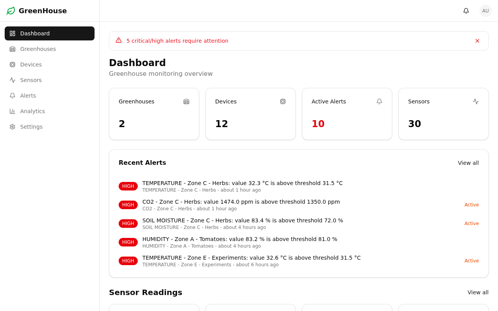
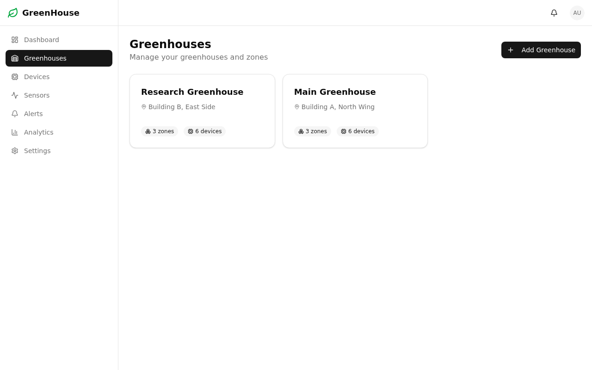
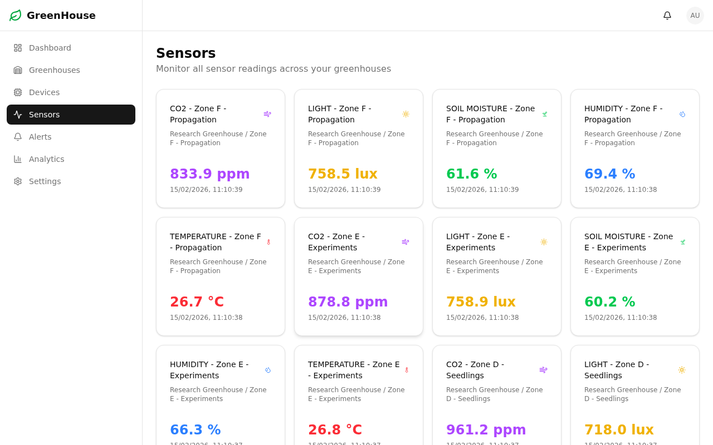
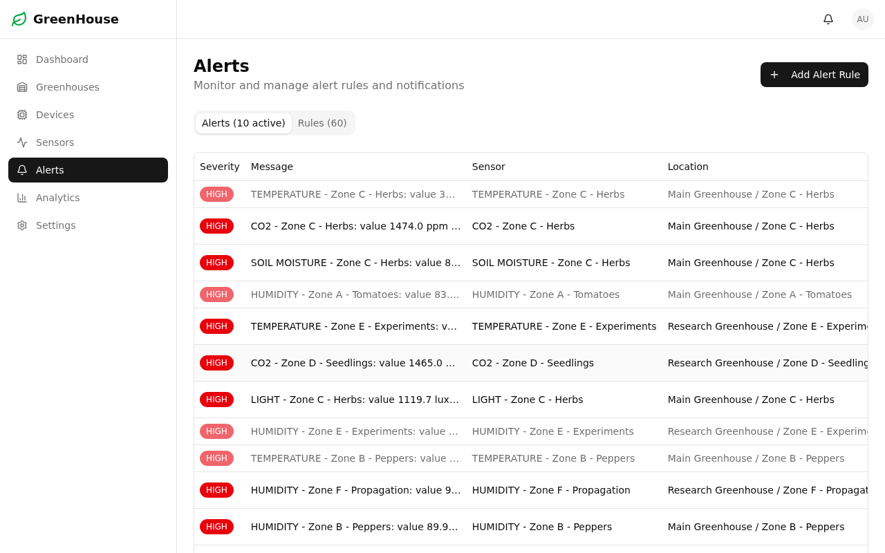
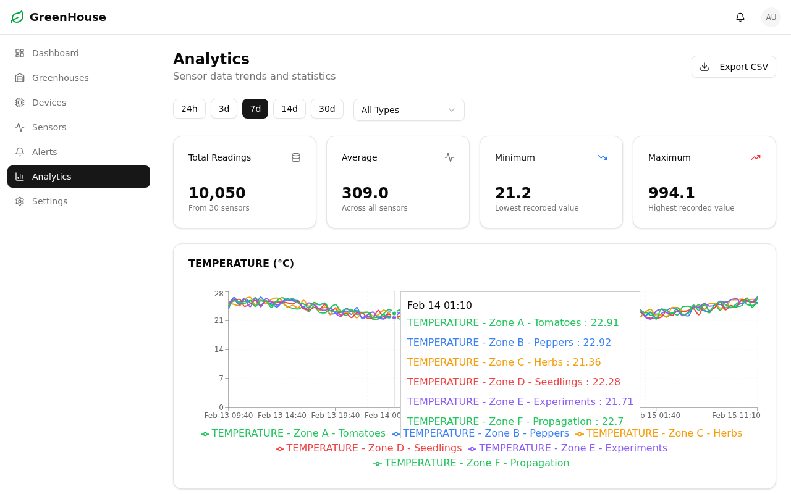

# Greenhouse IoT Monitor

A real-time dashboard for monitoring greenhouse environments through IoT sensors. Track temperature, humidity, soil moisture, light levels, and CO2 across multiple greenhouses, zones, and devices — with configurable alert rules and analytics.

## Features

- **Dashboard Overview** — Summary cards for greenhouses, devices, active alerts, and sensors with recent alert feed and live sensor grid
- **Greenhouse Management** — CRUD for greenhouses with zone organization and detail views
- **Device Tracking** — Table view of IoT devices (ESP32, Arduino Nano) with online/offline status
- **Sensor Monitoring** — Real-time readings with historical chart visualization per sensor
- **Alert System** — Configurable alert rules (above/below thresholds) with severity levels and acknowledgment workflow
- **Analytics** — Trend charts, stats cards, date range filtering, and CSV export
- **Authentication** — NextAuth credentials provider with role-based access (Admin/Viewer)
- **Responsive Layout** — Sidebar navigation with mobile-friendly sheet menu

## Screenshots

### Dashboard
Overview with stat cards, recent alerts, and live sensor grid.



### Greenhouses
Greenhouse list with zone and device counts.



### Sensors
Sensor monitoring with type badges and latest readings.



### Alerts
Alert table with severity badges and acknowledgment status.



### Analytics
Trend charts, stats cards, and date range filtering with CSV export.



## Tech Stack

- **Framework**: Next.js 16 (App Router)
- **Database**: SQLite via Prisma 7 with Better-SQLite3 adapter
- **Auth**: NextAuth.js 4 with credentials provider
- **UI**: shadcn/ui + Radix UI + Tailwind CSS 4
- **Charts**: Recharts
- **Forms**: React Hook Form + Zod validation

## Getting Started

### Prerequisites

- Node.js 20+
- npm

### Setup

```bash
# Install dependencies
npm install

# Copy environment variables
cp .env.example .env

# Generate Prisma client and run migrations
npx prisma generate
npx prisma db push

# Start the dev server
npm run dev
```

Open [http://localhost:3000](http://localhost:3000) to view the app.

### Seed Data

To populate the database with sample greenhouses, devices, sensors, and 30 days of readings:

```bash
curl -X POST http://localhost:3000/api/seed
```

This creates:
- 2 greenhouses with 3 zones each
- 12 devices (ESP32 and Arduino Nano)
- 30 sensors (temperature, humidity, soil moisture, light, CO2)
- ~43,000 sensor readings (30 days at 30-minute intervals)
- Alert rules and sample triggered alerts
- Admin user: `admin@greenhouse.io` / `password123`

## Project Structure

```
src/
├── app/
│   ├── (auth)/              # Login and registration pages
│   ├── (dashboard)/         # Protected dashboard routes
│   │   ├── alerts/          # Alert management
│   │   ├── analytics/       # Trend charts and CSV export
│   │   ├── devices/         # Device table view
│   │   ├── greenhouses/     # Greenhouse CRUD and detail views
│   │   ├── sensors/         # Sensor monitoring and charts
│   │   └── settings/        # User settings
│   └── api/                 # REST API routes
├── components/
│   ├── alerts/              # Alert banner, table, rule form
│   ├── analytics/           # Trend chart, stats, date picker, export
│   ├── devices/             # Device table, form, status badge
│   ├── greenhouses/         # Greenhouse card and form
│   ├── layout/              # Sidebar, header, mobile nav
│   ├── sensors/             # Sensor card, chart, grid
│   └── ui/                  # shadcn/ui component library
├── lib/                     # Auth config, Prisma client, utilities
└── types/                   # NextAuth type extensions
```

## Data Model

```
Greenhouse → Zone → Device → Sensor → SensorReading
                                    → AlertRule
                                    → Alert
```

Each greenhouse contains zones, which contain devices. Devices have sensors that produce readings. Sensors can have alert rules that trigger alerts when thresholds are exceeded.
